# Themes

NimLaunch themes control the launcher colors and the persisted active theme.

Themes are configured in `~/.config/nimlaunch/nimlaunch.toml` with repeated `[[themes]]` blocks, plus a `[theme]` section for the current selection.

## Theme Block

Example:

```toml
[[themes]]
name                = "Nord"
bgColorHex          = "#2E3440"
fgColorHex          = "#D8DEE9"
highlightBgColorHex = "#88C0D0"
highlightFgColorHex = "#2E3440"
borderColorHex      = "#4C566A"
matchFgColorHex     = "#f8c291"
```

Fields:

- **`name`**: Label shown in the `:t` selector.
- **`bgColorHex`**: Launcher background color.
- **`fgColorHex`**: Normal text color.
- **`highlightBgColorHex`**: Selected row background color.
- **`highlightFgColorHex`**: Selected row text color.
- **`borderColorHex`**: Border color.
- **`matchFgColorHex`**: Color used for matching characters in search results.

All colors must be valid hex codes in `#RRGGBB` format.

## Selecting A Theme

Use the built-in theme selector by typing:

`:t`

Then:
- Type to filter theme names.
- Use Up/Down to preview themes.
- Press `Enter` to keep the selected theme.
- Press `Esc` to cancel and exit the selector.

## Persisted Theme

The active saved theme is tracked separately:

```toml
[theme]
last_chosen = "Nord"
```

When a theme is accepted through the `:t` selector, NimLaunch writes that value back to the configuration file.

## Troubleshooting Theme Persistence

Common causes if a theme change does not persist:
- The configuration file is not writable.
- The configuration file contains invalid TOML syntax.
- The saved theme name does not exist in the `[[themes]]` list.

If the TOML is invalid, NimLaunch prints a startup parse warning and falls back to built-in defaults for that session.

## Custom Themes

You can add custom themes by appending additional `[[themes]]` blocks to your configuration file.

Example:

```toml
[[themes]]
name                = "My Theme"
bgColorHex          = "#111111"
fgColorHex          = "#f0f0f0"
highlightBgColorHex = "#2a2a2a"
highlightFgColorHex = "#ffffff"
borderColorHex      = "#555555"
matchFgColorHex     = "#ff8c42"
```

## Community Themes

Copy and paste these blocks into your `~/.config/nimlaunch/nimlaunch.toml` to use them.


### Arstotzka

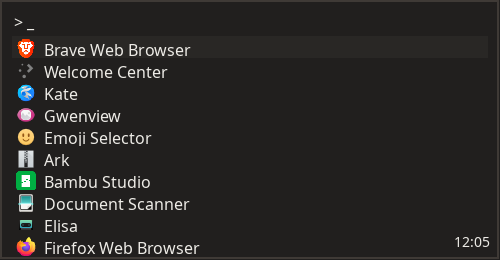

```toml
[[themes]]
name                = "Arstotzka"   
bgColorHex          = "#211f1e"
fgColorHex          = "#edebe6"
highlightBgColorHex = "#292725"
highlightFgColorHex = "#edebe6"
borderColorHex      = "#3f3a36"
matchFgColorHex     = "#516b6b"
```

### Azure

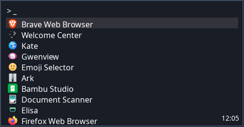

```toml
[[themes]]
name                = "Azure"
bgColorHex          = "#181d26"
fgColorHex          = "#ffffff"
highlightBgColorHex = "#33333c"
highlightFgColorHex = "#ffffff"
borderColorHex      = "#414d62"
matchFgColorHex     = "#52708b"
```

### Bold


```toml
[[themes]]
name                = "Bold"
bgColorHex          = "#2a2626"
fgColorHex          = "#ffffff"
highlightBgColorHex = "#393434"
highlightFgColorHex = "#ffffff"
borderColorHex      = "#534b4b"
matchFgColorHex     = "#f0624b"
```

### Box UK


```toml
[[themes]]
name                = "Box UK"
bgColorHex          = "#ffffff"
fgColorHex          = "#414f5c"
highlightBgColorHex = "#eeeeee"
highlightFgColorHex = "#414f5c"
borderColorHex      = "#b8b6b1"
matchFgColorHex     = "#019d76"
```

### Carbonight

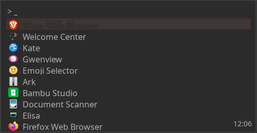

```toml
[[themes]]
name                = "Carbonight"
bgColorHex          = "#2e2c2b"
fgColorHex          = "#b0b0b0"
highlightBgColorHex = "#3b3633"
highlightFgColorHex = "#2e2c2b"
borderColorHex      = "#423f3d"
matchFgColorHex     = "#8c8c8c"
```

### Charcoal Dark


```toml
[[themes]]
name                = "Charcoal Dark"
bgColorHex          = "#120F09"
fgColorHex          = "#C0A179"
highlightBgColorHex = "#35291D"
highlightFgColorHex = "#D6B891"
borderColorHex      = "#887254"
matchFgColorHex     = ""
```

### Charcoal Light


```toml
[[themes]]
name                = "Charcoal Light"
bgColorHex          = "#d6b891"
fgColorHex          = "#35291d"
highlightBgColorHex = "#a28662"
highlightFgColorHex = "#120f09"
borderColorHex      = "#66553f"
matchFgColorHex     = ""
```

### Chocolate

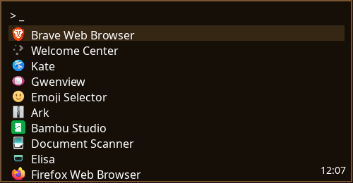

```toml
[[themes]]
name                = "Chocolate"
bgColorHex          = "#150f08"
fgColorHex          = "#ffffff"
highlightBgColorHex = "#362715"
highlightFgColorHex = "#ffffff"
borderColorHex      = "#795431"
matchFgColorHex     = "#ccb697"
```

### Cobalt

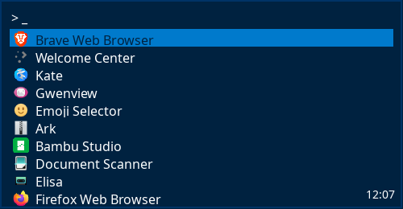

```toml
[[themes]]
name                = "Cobalt"
bgColorHex          = "#002240"
fgColorHex          = "#FFFFFF"
highlightBgColorHex = "#007ACC"
highlightFgColorHex = "#002240"
borderColorHex      = "#003366"
matchFgColorHex     = ""
```

### Crisp

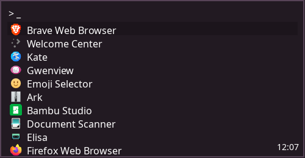

```toml
[[themes]]
name                = "Crisp"
bgColorHex          = "#221a22"
fgColorHex          = "#ffffff"
highlightBgColorHex = "#1c151c"
highlightFgColorHex = "#ffffff"
borderColorHex      = "#574457"
matchFgColorHex     = "#765478"
```

### Darkside

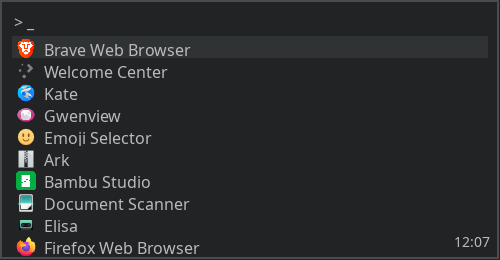

```toml
[[themes]]
name                = "Darkside"
bgColorHex          = "#222324"
fgColorHex          = "#bababa"
highlightBgColorHex = "#303333"
highlightFgColorHex = "#bababa"
borderColorHex      = "#494b4d"
matchFgColorHex     = "#e8341c"
```

### Earthsong

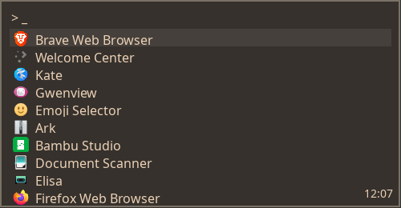

```toml
[[themes]]
name                = "Earthsong"
bgColorHex          = "#36312c"
fgColorHex          = "#ebd1b7"
highlightBgColorHex = "#45403b"
highlightFgColorHex = "#ebd1b7"
borderColorHex      = "#7a7267"
matchFgColorHex     = "#db784d"
```

### Earthsong Light


```toml
[[themes]]
name                = "Earthsong Light"
bgColorHex          = "#ffffff"
fgColorHex          = "#4d463e"
highlightBgColorHex = "#eeeeee"
highlightFgColorHex = "#4d463e"
borderColorHex      = "#d6cab9"
matchFgColorHex     = "#db784d"
```

### FreshCut

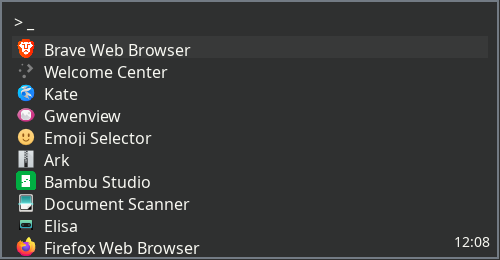

```toml
[[themes]]
name                = "FreshCut"
bgColorHex          = "#2f3030"
fgColorHex          = "#f8f8f2"
highlightBgColorHex = "#383939"
highlightFgColorHex = "#f8f8f2"
borderColorHex      = "#737b84"
matchFgColorHex     = "#00a8c6"
```

### Frontier

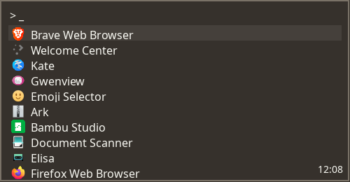

```toml
[[themes]]
name                = "Frontier"
bgColorHex          = "#36312c"
fgColorHex          = "#f8f8f2"
highlightBgColorHex = "#45403b"
highlightFgColorHex = "#f8f8f2"
borderColorHex      = "#7a7267"
matchFgColorHex     = "#f23a3a"
```

### GitHub

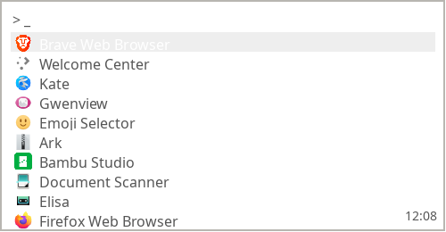

```toml
[[themes]]
name                = "GitHub"
bgColorHex          = "#ffffff"
fgColorHex          = "#555555"
highlightBgColorHex = "#eeeeee"
highlightFgColorHex = "#ffffff"
borderColorHex      = "#b8b6b1"
matchFgColorHex     = "#008080"
```

### Gloom

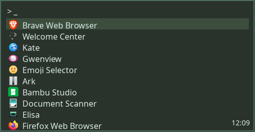

```toml
[[themes]]
name                = "Gloom"
bgColorHex          = "#2a332b"
fgColorHex          = "#d8ebe5"
highlightBgColorHex = "#3c4d3e"
highlightFgColorHex = "#d8ebe5"
borderColorHex      = "#4f6e64"
matchFgColorHex     = "#ff5d38"
```

### Glowfish

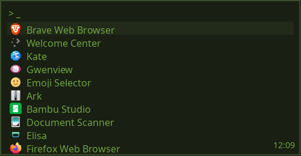

```toml
[[themes]]
name                = "Glowfish"
bgColorHex          = "#191f13"
fgColorHex          = "#6ea240"
highlightBgColorHex = "#222a1a"
highlightFgColorHex = "#6ea240"
borderColorHex      = "#3c4e2d"
matchFgColorHex     = "#db784d"
```

### Goldfish

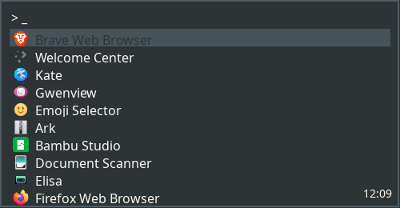

```toml
[[themes]]
name                = "Goldfish"
bgColorHex          = "#2e3336"
fgColorHex          = "#f8f8f2"
highlightBgColorHex = "#465459"
highlightFgColorHex = "#2e3336"
borderColorHex      = "#505c63"
matchFgColorHex     = "#fa6900"
```

### Grunge

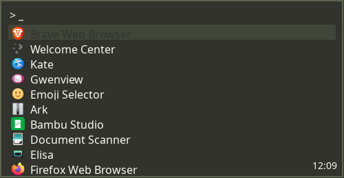

```toml
[[themes]]
name                = "Grunge"
bgColorHex          = "#31332c"
fgColorHex          = "#f8f8f2"
highlightBgColorHex = "#41453a"
highlightFgColorHex = "#31332c"
borderColorHex      = "#5c634f"
matchFgColorHex     = "#f56991"
```

### Halflife

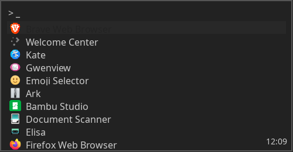

```toml
[[themes]]
name                = "Halflife"
bgColorHex          = "#222222"
fgColorHex          = "#cccccc"
highlightBgColorHex = "#282828"
highlightFgColorHex = "#222222"
borderColorHex      = "#555555"
matchFgColorHex     = "#7d8991"
```

### Hyrule


```toml
[[themes]]
name                = "Hyrule"
bgColorHex          = "#2d2c2b"
fgColorHex          = "#c0d5c1"
highlightBgColorHex = "#3d3934"
highlightFgColorHex = "#2d2c2b"
borderColorHex      = "#716d6a"
matchFgColorHex     = "#569e16"
```

### Iceberg


```toml
[[themes]]
name                = "Iceberg"
bgColorHex          = "#323b3d"
fgColorHex          = "#bdd6db"
highlightBgColorHex = "#3e4c4f"
highlightFgColorHex = "#323b3d"
borderColorHex      = "#537178"
matchFgColorHex     = "#2d8da1"
```

### Juicy

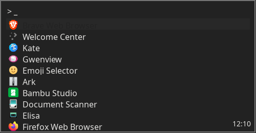

```toml
[[themes]]
name                = "Juicy"
bgColorHex          = "#222222"
fgColorHex          = "#e3e2e0"
highlightBgColorHex = "#282828"
highlightFgColorHex = "#222222"
borderColorHex      = "#777777"
matchFgColorHex     = "#3bc7b8"
```

### Keen

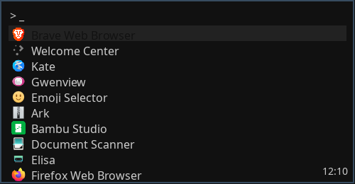

```toml
[[themes]]
name                = "Keen"
bgColorHex          = "#111111"
fgColorHex          = "#cccccc"
highlightBgColorHex = "#222222"
highlightFgColorHex = "#111111"
borderColorHex      = "#374c60"
matchFgColorHex     = "#8767b7"
```

### Kiwi

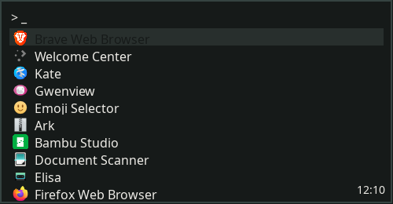

```toml
[[themes]]
name                = "Kiwi"
bgColorHex          = "#161a19"
fgColorHex          = "#edebe6"
highlightBgColorHex = "#282f2d"
highlightFgColorHex = "#161a19"
borderColorHex      = "#354341"
matchFgColorHex     = "#95c72a"
```

### Laravel

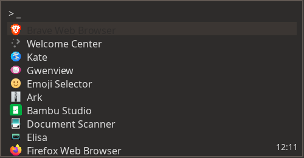

```toml
[[themes]]
name                = "Laravel"
bgColorHex          = "#2e2c2b"
fgColorHex          = "#dedede"
highlightBgColorHex = "#3b3633"
highlightFgColorHex = "#2e2c2b"
borderColorHex      = "#615953"
matchFgColorHex     = "#fc6b0a"
```

### Lavender

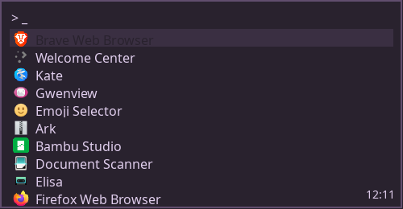

```toml
[[themes]]
name                = "Lavender"
bgColorHex          = "#29222e"
fgColorHex          = "#e0ceed"
highlightBgColorHex = "#3a2f42"
highlightFgColorHex = "#29222e"
borderColorHex      = "#614e6e"
matchFgColorHex     = "#b657ff"
```

### Legacy

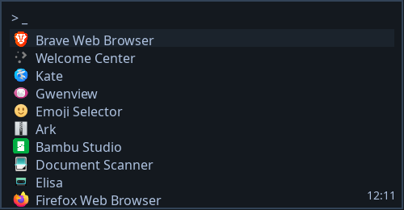

```toml
[[themes]]
name                = "Legacy"
bgColorHex          = "#14191f"
fgColorHex          = "#aec2e0"
highlightBgColorHex = "#1b232c"
highlightFgColorHex = "#aec2e0"
borderColorHex      = "#324357"
matchFgColorHex     = ""
```

### Material Dark


```toml
[[themes]]
name                = "Material Dark"
bgColorHex          = "#263238"
fgColorHex          = "#ECEFF1"
highlightBgColorHex = "#FFAB40"
highlightFgColorHex = "#263238"
borderColorHex      = "#37474F"
matchFgColorHex     = ""
```

### Material Light


```toml
[[themes]]
name                = "Material Light"
bgColorHex          = "#FAFAFA"
fgColorHex          = "#212121"
highlightBgColorHex = "#FFAB40"
highlightFgColorHex = "#FAFAFA"
borderColorHex      = "#BDBDBD"
matchFgColorHex     = ""
```

### Mellow

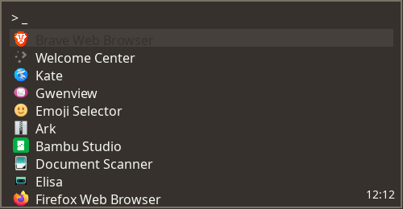

```toml
[[themes]]
name                = "Mellow"
bgColorHex          = "#36312c"
fgColorHex          = "#f8f8f2"
highlightBgColorHex = "#45403b"
highlightFgColorHex = "#36312c"
borderColorHex      = "#7a7267"
matchFgColorHex     = "#1f8181"
```

### Mintchoc

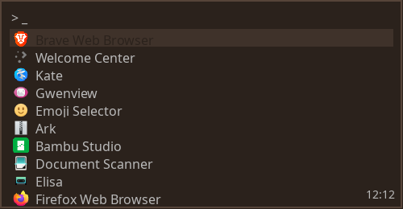

```toml
[[themes]]
name                = "Mintchoc"
bgColorHex          = "#2b221c"
fgColorHex          = "#bababa"
highlightBgColorHex = "#3f322a"
highlightFgColorHex = "#2b221c"
borderColorHex      = "#564439"
matchFgColorHex     = "#008d62"
```

### Monokai

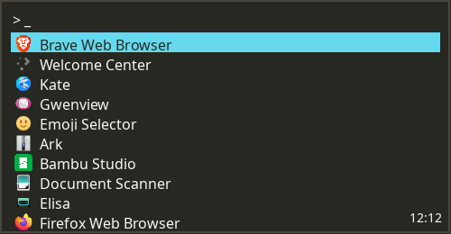

```toml
[[themes]]
name                = "Monokai"
bgColorHex          = "#272822"
fgColorHex          = "#F8F8F2"
highlightBgColorHex = "#66D9EF"
highlightFgColorHex = "#272822"
borderColorHex      = "#49483E"
matchFgColorHex     = ""
```

### Monokai Pro


```toml
[[themes]]
name                = "Monokai Pro"
bgColorHex          = "#2D2A2E"
fgColorHex          = "#FCFCFA"
highlightBgColorHex = "#78DCE8"
highlightFgColorHex = "#2D2A2E"
borderColorHex      = "#5B595C"
matchFgColorHex     = ""
```

### Mud

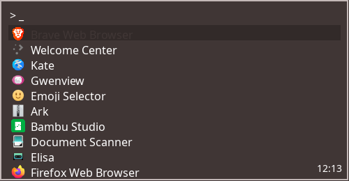

```toml
[[themes]]
name                = "Mud"
bgColorHex          = "#403635"
fgColorHex          = "#ffffff"
highlightBgColorHex = "#322a29"
highlightFgColorHex = "#403635"
borderColorHex      = "#c3b8b7"
matchFgColorHex     = "#ff9787"
```

### One Dark


```toml
[[themes]]
name                = "One Dark"
bgColorHex          = "#282C34"
fgColorHex          = "#ABB2BF"
highlightBgColorHex = "#61AFEF"
highlightFgColorHex = "#282C34"
borderColorHex      = "#3E4451"
matchFgColorHex     = ""
```

### One Light


```toml
[[themes]]
name                = "One Light"
bgColorHex          = "#FAFAFA"
fgColorHex          = "#383A42"
highlightBgColorHex = "#4078F2"
highlightFgColorHex = "#FAFAFA"
borderColorHex      = "#E5E5E6"
matchFgColorHex     = ""
```

### Otakon

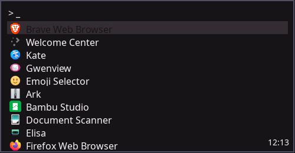

```toml
[[themes]]
name                = "Otakon"
bgColorHex          = "#171417"
fgColorHex          = "#f9f3f9"
highlightBgColorHex = "#332d33"
highlightFgColorHex = "#171417"
borderColorHex      = "#515166"
matchFgColorHex     = "#f6e6eb"
```

### Palenight

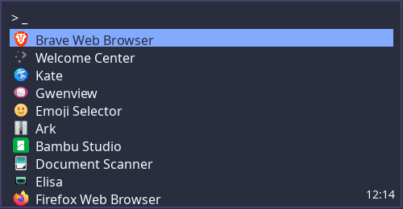

```toml
[[themes]]
name                = "Palenight"
bgColorHex          = "#292D3E"
fgColorHex          = "#EEFFFF"
highlightBgColorHex = "#82AAFF"
highlightFgColorHex = "#292D3E"
borderColorHex      = "#444267"
matchFgColorHex     = ""
```

### Pastel

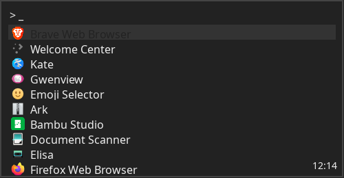

```toml
[[themes]]
name                = "Pastel"
bgColorHex          = "#222222"
fgColorHex          = "#eeeeee"
highlightBgColorHex = "#333333"
highlightFgColorHex = "#222222"
borderColorHex      = "#444444"
matchFgColorHex     = "#04c4a5"
```

### Patriot

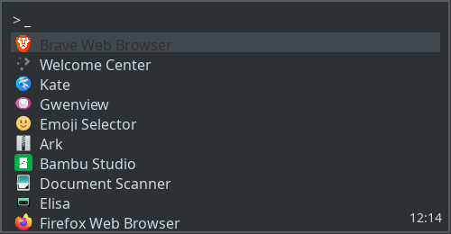

```toml
[[themes]]
name                = "Patriot"
bgColorHex          = "#2d3133"
fgColorHex          = "#cad9e3"
highlightBgColorHex = "#40484d"
highlightFgColorHex = "#2d3133"
borderColorHex      = "#515e66"
matchFgColorHex     = "#2e6fd9"
```

### Peacock

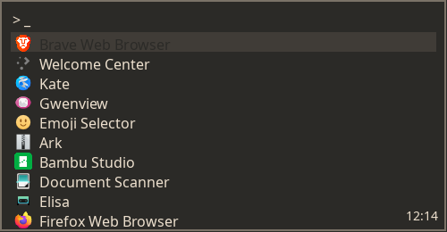

```toml
[[themes]]
name                = "Peacock"
bgColorHex          = "#2b2a27"
fgColorHex          = "#ede0ce"
highlightBgColorHex = "#403c37"
highlightFgColorHex = "#2b2a27"
borderColorHex      = "#7a7267"
matchFgColorHex     = "#ff5d38"
```

### Peacocks In Space


```toml
[[themes]]
name                = "Peacocks In Space"
bgColorHex          = "#2b303b"
fgColorHex          = "#dee3ec"
highlightBgColorHex = "#272b34"
highlightFgColorHex = "#2b303b"
borderColorHex      = "#6e7a94"
matchFgColorHex     = "#ff5d38"
```

### Peel

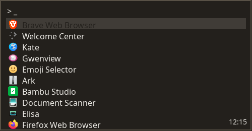

```toml
[[themes]]
name                = "Peel"
bgColorHex          = "#23201c"
fgColorHex          = "#edebe6"
highlightBgColorHex = "#403c37"
highlightFgColorHex = "#23201c"
borderColorHex      = "#585146"
matchFgColorHex     = "#d3643b"
```

### Piggy

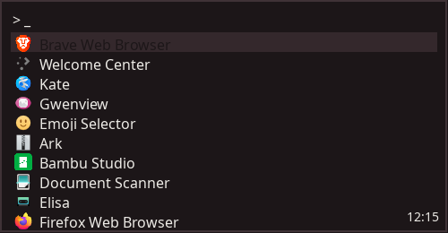

```toml
[[themes]]
name                = "Piggy"
bgColorHex          = "#1c1618"
fgColorHex          = "#edebe6"
highlightBgColorHex = "#34282c"
highlightFgColorHex = "#1c1618"
borderColorHex      = "#3f3236"
matchFgColorHex     = "#fd6a5d"
```

### Potpourri

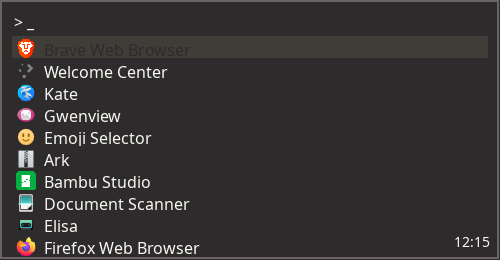

```toml
[[themes]]
name                = "Potpourri"
bgColorHex          = "#2e2b2c"
fgColorHex          = "#f8f8f2"
highlightBgColorHex = "#403c37"
highlightFgColorHex = "#2e2b2c"
borderColorHex      = "#696363"
matchFgColorHex     = "#ed1153"
```

### Rainbow

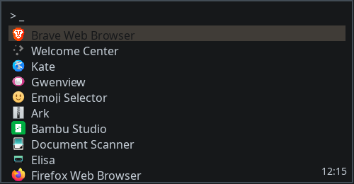

```toml
[[themes]]
name                = "Rainbow"
bgColorHex          = "#16181a"
fgColorHex          = "#c7d0d9"
highlightBgColorHex = "#403c37"
highlightFgColorHex = "#16181a"
borderColorHex      = "#424c55"
matchFgColorHex     = "#ef746f"
```

### Revelation

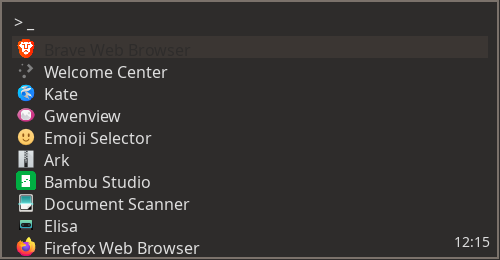

```toml
[[themes]]
name                = "Revelation"
bgColorHex          = "#2e2c2b"
fgColorHex          = "#dedede"
highlightBgColorHex = "#3b3633"
highlightFgColorHex = "#2e2c2b"
borderColorHex      = "#7b726b"
matchFgColorHex     = "#617fa0"
```

### Shrek

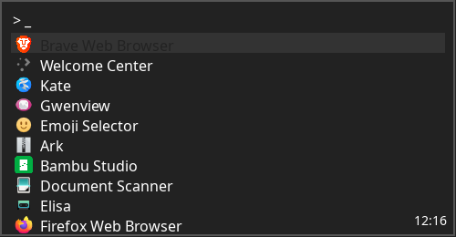

```toml
[[themes]]
name                = "Shrek"
bgColorHex          = "#222222"
fgColorHex          = "#ffffff"
highlightBgColorHex = "#333333"
highlightFgColorHex = "#222222"
borderColorHex      = "#555555"
matchFgColorHex     = "#857a5e"
```

### Slate

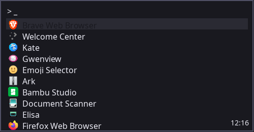

```toml
[[themes]]
name                = "Slate"
bgColorHex          = "#19191f"
fgColorHex          = "#ebebf4"
highlightBgColorHex = "#2a2a33"
highlightFgColorHex = "#19191f"
borderColorHex      = "#515166"
matchFgColorHex     = "#89a7b1"
```

### Slime

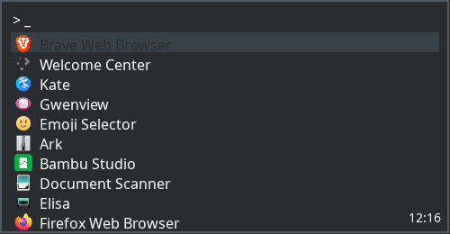

```toml
[[themes]]
name                = "Slime"
bgColorHex          = "#292d30"
fgColorHex          = "#ffffff"
highlightBgColorHex = "#384147"
highlightFgColorHex = "#292d30"
borderColorHex      = "#4f5a63"
matchFgColorHex     = "#9fb3c2"
```

### Snappy

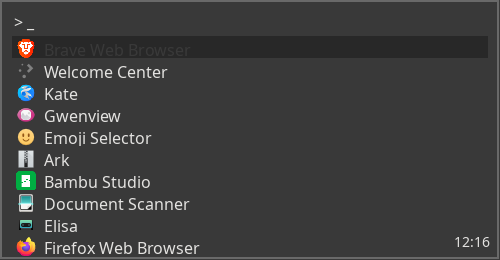

```toml
[[themes]]
name                = "Snappy"
bgColorHex          = "#393939"
fgColorHex          = "#e3e2e0"
highlightBgColorHex = "#282828"
highlightFgColorHex = "#393939"
borderColorHex      = "#696969"
matchFgColorHex     = "#f66153"
```

### Snappy Light


```toml
[[themes]]
name                = "Snappy Light"
bgColorHex          = "#ffffff"
fgColorHex          = "#555555"
highlightBgColorHex = "#eeeeee"
highlightFgColorHex = "#ffffff"
borderColorHex      = "#bbbbbb"
matchFgColorHex     = "#f66153"
```

### Solarflare

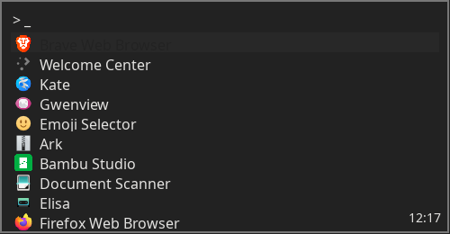

```toml
[[themes]]
name                = "Solarflare"
bgColorHex          = "#222222"
fgColorHex          = "#e3e2e0"
highlightBgColorHex = "#282828"
highlightFgColorHex = "#222222"
borderColorHex      = "#777777"
matchFgColorHex     = "#ff4e50"
```

### Solarized Dark


```toml
[[themes]]
name                = "Solarized Dark"
bgColorHex          = "#002B36"
fgColorHex          = "#839496"
highlightBgColorHex = "#268BD2"
highlightFgColorHex = "#002B36"
borderColorHex      = "#073642"
matchFgColorHex     = ""
```

### Solarized Light


```toml
[[themes]]
name                = "Solarized Light"
bgColorHex          = "#FDF6E3"
fgColorHex          = "#657B83"
highlightBgColorHex = "#268BD2"
highlightFgColorHex = "#FDF6E3"
borderColorHex      = "#EEE8D5"
matchFgColorHex     = ""
```

### Sourlick

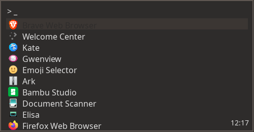

```toml
[[themes]]
name                = "Sourlick"
bgColorHex          = "#2e2c2b"
fgColorHex          = "#dedede"
highlightBgColorHex = "#3b3633"
highlightFgColorHex = "#2e2c2b"
borderColorHex      = "#615953"
matchFgColorHex     = "#8ac27a"
```

### Spearmint

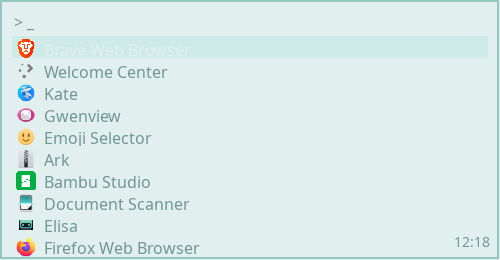

```toml
[[themes]]
name                = "Spearmint"
bgColorHex          = "#e1f0ee"
fgColorHex          = "#719692"
highlightBgColorHex = "#ceebe7"
highlightFgColorHex = "#e1f0ee"
borderColorHex      = "#93c7c0"
matchFgColorHex     = "#25808a"
```

### Stark

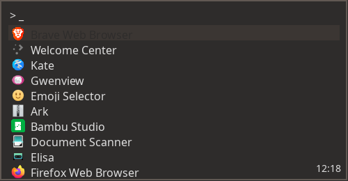

```toml
[[themes]]
name                = "Stark"
bgColorHex          = "#2e2c2b"
fgColorHex          = "#dedede"
highlightBgColorHex = "#3b3633"
highlightFgColorHex = "#2e2c2b"
borderColorHex      = "#615953"
matchFgColorHex     = "#f03113"
```

### Super

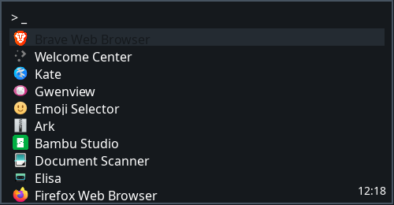

```toml
[[themes]]
name                = "Super"
bgColorHex          = "#15191d"
fgColorHex          = "#ffffff"
highlightBgColorHex = "#242b32"
highlightFgColorHex = "#15191d"
borderColorHex      = "#465360"
matchFgColorHex     = "#d60257"
```

### Synthwave 84


```toml
[[themes]]
name                = "Synthwave 84"
bgColorHex          = "#2A2139"
fgColorHex          = "#FFFFFF"
highlightBgColorHex = "#F92AAD"
highlightFgColorHex = "#2A2139"
borderColorHex      = "#495495"
matchFgColorHex     = ""
```

### Tokyo Night


```toml
[[themes]]
name                = "Tokyo Night"
bgColorHex          = "#1A1B26"
fgColorHex          = "#A9B1D6"
highlightBgColorHex = "#7AA2F7"
highlightFgColorHex = "#1A1B26"
borderColorHex      = "#32344A"
matchFgColorHex     = ""
```

### Tokyo Night Light


```toml
[[themes]]
name                = "Tokyo Night Light"
bgColorHex          = "#D5D6DB"
fgColorHex          = "#343B58"
highlightBgColorHex = "#34548A"
highlightFgColorHex = "#D5D6DB"
borderColorHex      = "#CBCCD1"
matchFgColorHex     = ""
```

### Tonic

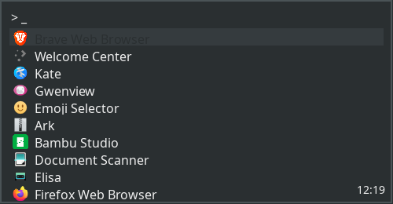

```toml
[[themes]]
name                = "Tonic"
bgColorHex          = "#2a2f31"
fgColorHex          = "#eeeeee"
highlightBgColorHex = "#353b3e"
highlightFgColorHex = "#2a2f31"
borderColorHex      = "#4a5356"
matchFgColorHex     = "#b8cd44"
```

### Tribal

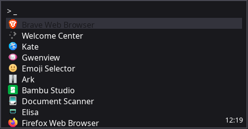

```toml
[[themes]]
name                = "Tribal"
bgColorHex          = "#19191d"
fgColorHex          = "#ffffff"
highlightBgColorHex = "#33333c"
highlightFgColorHex = "#19191d"
borderColorHex      = "#4a4a54"
matchFgColorHex     = "#5f5582"
```

### Tron

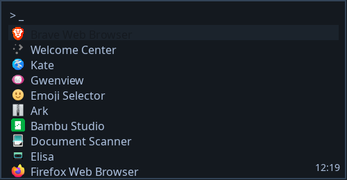

```toml
[[themes]]
name                = "Tron"
bgColorHex          = "#14191f"
fgColorHex          = "#aec2e0"
highlightBgColorHex = "#1b232c"
highlightFgColorHex = "#14191f"
borderColorHex      = "#324357"
matchFgColorHex     = "#ffffff"
```

### Turnip

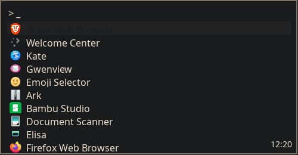

```toml
[[themes]]
name                = "Turnip"
bgColorHex          = "#1a1b1d"
fgColorHex          = "#ede0ce"
highlightBgColorHex = "#222222"
highlightFgColorHex = "#1a1b1d"
borderColorHex      = "#7a7267"
matchFgColorHex     = "#487d76"
```

### Userscape

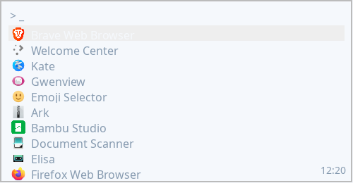

```toml
[[themes]]
name                = "Userscape"
bgColorHex          = "#f5f8fc"
fgColorHex          = "#879bb0"
highlightBgColorHex = "#eeeeee"
highlightFgColorHex = "#f5f8fc"
borderColorHex      = "#bbbbbb"
matchFgColorHex     = "#355b8c"
```

### Yule


```toml
[[themes]]
name                = "Yule"
bgColorHex          = "#2b2a27"
fgColorHex          = "#ede0ce"
highlightBgColorHex = "#52504b"
highlightFgColorHex = "#2b2a27"
borderColorHex      = "#7a7267"
matchFgColorHex     = "#d63131"
```

### Zacks


```toml
[[themes]]
name                = "Zacks"
bgColorHex          = "#222222"
fgColorHex          = "#f0f0f0"
highlightBgColorHex = "#333333"
highlightFgColorHex = "#222222"
borderColorHex      = "#777777"
matchFgColorHex     = "#ff6a38"
```


## Reference Files

The generated default theme set is embedded in:

- [`src/state.nim`](../src/state.nim)

The checked-in sample config lives at:

- [examples/nimlaunch.toml](../examples/nimlaunch.toml)

## Related Docs

- [Configuration](configuration.md)
- [Groups and Shortcuts](groups-and-shortcuts.md)
- [Dmenu Mode](dmenu.md)
